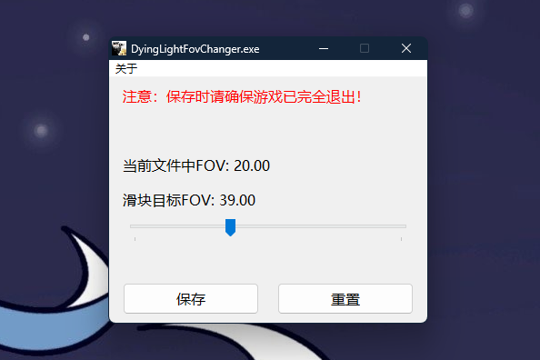

# 消逝的光芒FOV更改器 (Dying Light FOV Changer)

一个为《消逝的光芒1》制作的、简单易用的视野（FOV）修改工具。通过直观的图形化界面，帮助玩家轻松自定义游戏内的视野大小，而无需手动编辑配置文件。

A simple and easy-to-use Field of View (FOV) modification tool for *Dying Light 1*. It helps players customize the in-game FOV through an intuitive graphical interface without manually editing configuration files.

## 界面预览 (Screenshot)

## ✨ 功能特性 (Features)

* **直观的图形化界面**：所有操作通过滑块和按钮完成，简单明了。
* **实时预览**：界面清晰展示“当前文件中”的FOV值和“滑块目标”FOV值，方便对比。
* **宽范围调节**：支持从 5 到 100 的超大FOV调节范围。
* **一键重置**：可随时将FOV值重置为官方推荐的 `20.00` 并自动保存。
* **启动时自动读取**：每次打开工具，都会自动读取并显示当前已保存的FOV值。
* **安全提示**：界面包含醒目的红色提示，提醒用户在保存设置时需关闭游戏。
* **轻量便携**：由 AutoHotkey 编译，程序文件极小，无需安装，即下即用。

## 🚀 如何获取 (Download & Installation)

最简单的方式是直接从本项目的 "Releases" 页面下载已编译好的程序。

1.  **[前往 Releases 页面](https://github.com/kamjin3086/DyingLightChangeFOV/releases)**
2.  在最新版本中，找到并下载 `.exe` 文件（例如 `DyingLightFovChanger.exe`）。
3.  下载后无需安装，直接可以使用。

## 🛠️ 使用方法 (How to Use)

1.  **最重要的一步：确保《消逝的光芒》游戏已完全关闭！** 在游戏运行时修改配置文件可能导致设置无效或被覆盖。
2.  双击运行下载的 `DyingLightFovChanger.exe` 文件。
3.  程序会自动读取你当前的FOV设置，并显示在“当前文件中FOV”一栏。
4.  拖动滑块，选择你想要的FOV值，“滑块目标FOV”会实时更新。
5.  调整满意后，点击 **【保存】** 按钮。程序会修改配置文件并弹出成功提示。
6.  如果想恢复默认值，直接点击 **【重置】** 按钮即可，程序会自动将FOV设为 `20.00` 并保存。
7.  修改完毕后，启动游戏即可享受新的FOV！

## 👨‍💻 从源码编译 (Building from Source)

如果你想自行修改或编译此工具，请按以下步骤操作：

1.  安装 [AutoHotkey v1](https://www.autohotkey.com/)。
2.  下载或克隆本项目源码 (`.ahk` 文件)。
3.  在 `.ahk` 文件上点击鼠标右键，选择 "Compile Script" 即可生成 `.exe` 文件。

## 📄 授权协议 (License)

本项目采用 MIT 授权协议

## 🙏 致谢 (Acknowledgements)

感谢 [AutoHotkey](https://www.autohotkey.com/) 提供了如此强大而轻便的自动化工具。
